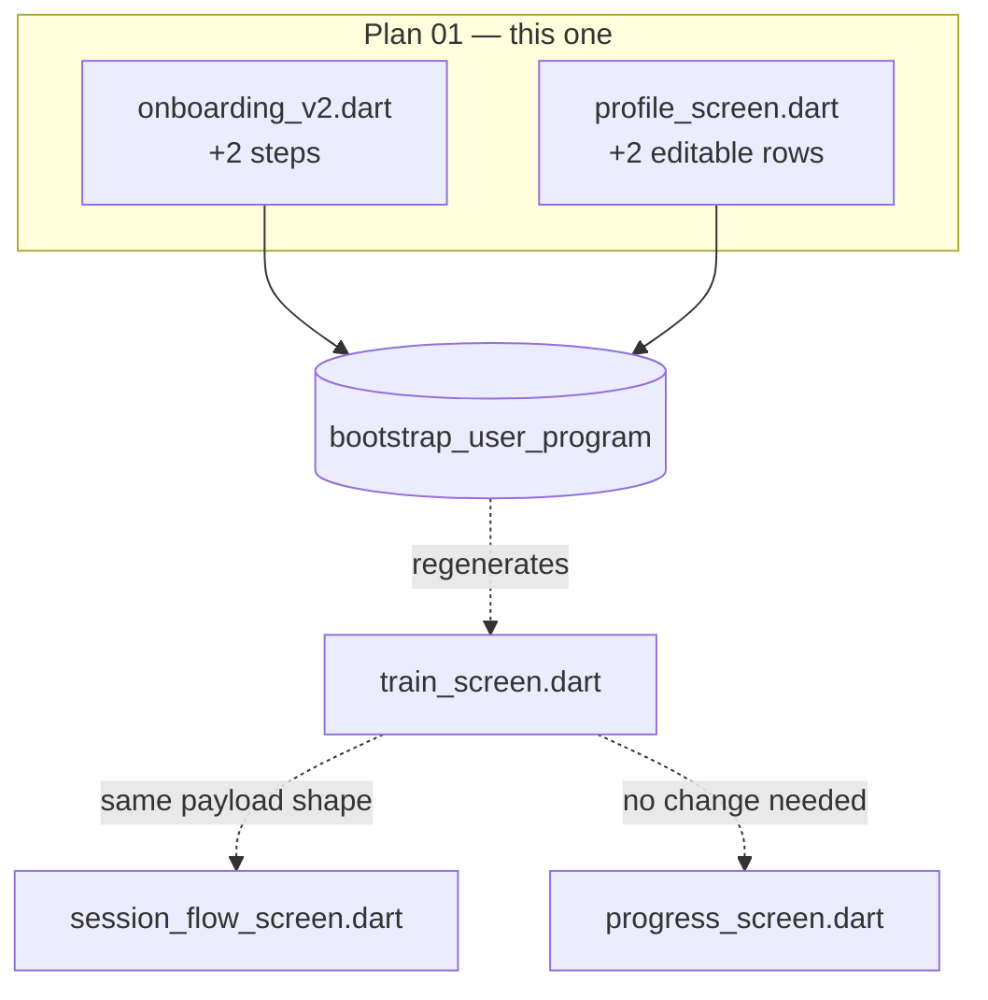

# Plan Builder 01 — Correct Splits and Real Intake

> **For agentic workers:** REQUIRED SUB-SKILL: Use superpowers:subagent-driven-development (recommended) or superpowers:executing-plans to implement this plan task-by-task. Steps use checkbox (`- [ ]`) syntax for tracking.

**Goal:** Make all three splits generate anatomically complete plans, and start collecting the two intake fields (`experience`, `environment`) the schema already has but nobody ever fills.

**Architecture:** One SQL migration replaces the generator's "one movement pattern per day, exactly 4 exercises" assumption with "a set of patterns per day, exercise count derived from muscles covered." Two new onboarding steps write `experience` and `environment`; Profile gains rows to edit them. A backfill gives existing users today's implicit defaults so nothing changes underneath them.

**Tech Stack:** Flutter 3.x / Dart 3 · Supabase Postgres 17 (plpgsql RPCs) · `flutter_test` · dockerised `psql` for SQL tests

**Spec:** `docs/superpowers/specs/2026-08-23-exercise-plan-builder-design.md` (§1 the bugs, §5 the user model, §10 onboarding, §12 Phase 0–1, §13.1 rollout)

## Global Constraints

- Migrations live in `supabase/migrations_v2/`, numbered `v2_00NN_<topic>.sql`, applied in numeric order. **Next free number is `v2_0021`.** Each must be idempotent and safe to re-run.
- Target project is **Load** (`saiwblhqfyxpwkgnhptd`). Verify before applying anything.
- All SQL is applied and tested through dockerised `postgres:17-alpine` psql over the pooler host (`aws-0-ap-northeast-1.pooler.supabase.com`), because the direct host is IPv6-only and unreachable.
- DB password comes from `LOAD_SUPABASE_DB_PASSWORD` in `.env`. **Never echo it.**
- Every tappable added to `lib/screens/**` uses `Pressable` from `lib/widgets/pressable.dart` — never a raw `GestureDetector`/`InkWell`. Enforced by `tool/check_interactivity.sh` (see `CLAUDE.md`).
- Dart style: `flutter analyze lib` must report no new issues. Four pre-existing infos are expected and must not grow.
- This plan changes **no** user-visible plan content for existing users. Their `experience`/`environment` backfill equals today's implicit behaviour.

---

## Programme context — how the whole spec decomposes

This plan is #1 of 7. The spec's Phases 0–7 are too large for one plan; each of these produces working, testable software on its own.

| # | Plan | Spec phases | Depends on |
|---|---|---|---|
| **01** | **Correct splits + real intake** (this doc) | 0, 1 | — |
| 02 | Catalog import (free-exercise-db → Core/Extended + guide images) | 2 | 01 |
| 03 | Volume-driven generator + shape transitions | 3, 3.5 | 01, 02 |
| 04 | Experience-tuned progression + deload | 4 | 03 |
| 05 | Exercise swap | 5 | 02 |
| 06 | Level transitions (promotion detector + coach proposal) | 6 | 04 |
| 07 | Program lifecycle / blocks | 7 | 06 |

### Database change map (whole programme)

**New tables**

| Table | Plan | Purpose |
|---|---|---|
| `volume_targets` | 03 | Tunable sets/reps/rest per (experience, goal) — avoids a migration per tuning change |

**Updated tables**

| Table | Change | Plan |
|---|---|---|
| `exercises` | `+ min_experience`, `+ mechanic`, `+ force`, `+ is_core`, `+ source` | 02 |
| `program_day_exercises` | `+ swapped_from_exercise_id`, `+ is_user_choice` | 05 |
| `programs` | `+ generator_version` | 03 |
| `training_profiles` | no new columns — starts *using* `experience`, `environment`, and `valid_from`/`valid_to` versioning | **01**, 06 |
| `storage.buckets` | `exercise-media` gains ~580 imported guide images | 02 |

**Updated functions**

| Function | Change | Plan |
|---|---|---|
| `bootstrap_user_program` | pattern-set days + derived exercise count | **01** |
| `bootstrap_user_program` | volume-driven selection, goal-aware prescription | 03 |
| `train_screen` | experience-tuned prefill, ramp factor, deload | 04 |
| `lift_status` | reused as-is by the promotion detector | 06 |

### Screen impact map (whole programme)



| Screen | Plan 01 | Later plans |
|---|---|---|
| `onboarding_v2.dart` | **+2 steps** (experience, environment) | — |
| `profile_screen.dart` | **+2 rows** in Your plan | 03 rebuild diff · 04 deload copy |
| `train_screen.dart` | **none** — payload shape unchanged | 05 swap entry · 02 new guide images |
| `session_flow_screen.dart` | **none** | 04 deload messaging · 02 images |
| `progress_screen.dart` | **none** | 03 planned-vs-actual volume |
| `trainer_screen.dart` | **none** | 06 transition proposals |

**Cascade rule that matters:** `train_screen.dart` and `session_flow_screen.dart` both consume `PlanExerciseV2`. Any change to that model forces edits in **three** files (`models/v2_models.dart`, `screens/v2/train_screen.dart`, `services/session_controller.dart`) plus `session_flow_screen.dart`. **Plan 01 deliberately changes neither the model nor the RPC payload**, so those four files stay untouched — that is what keeps this plan safe to ship alone.

---

## File structure (this plan)

| File | Status | Responsibility |
|---|---|---|
| `tool/db_test.sh` | create | Run a `.sql` test file against Load inside a transaction, always roll back |
| `supabase/tests/v2_0021_split_coverage_test.sql` | create | Assert every split produces complete muscle coverage |
| `supabase/migrations_v2/v2_0021_split_muscle_sets.sql` | create | The generator fix |
| `supabase/migrations_v2/v2_0022_backfill_intake.sql` | create | Give existing users today's implicit defaults |
| `lib/models/v2_models.dart` | modify | `OnboardingDraft` gains `experience`, `environment` |
| `lib/services/supabase_service_v2.dart` | modify | `submitOnboarding` writes the two fields |
| `lib/screens/v2/onboarding_v2.dart` | modify | Two new steps + a shared choice card |
| `lib/screens/v2/profile_screen.dart` | modify | Two editable rows in Your plan |
| `test/models/onboarding_draft_test.dart` | create | Dart unit test for the new draft fields |

---

## Task 1: SQL test harness

**Files:**
- Create: `tool/db_test.sh`
- Create: `supabase/tests/v2_0021_split_coverage_test.sql`

**Interfaces:**
- Consumes: nothing.
- Produces: `./tool/db_test.sh <file.sql>` — applies migrations + a test file in one transaction, prints `RAISE NOTICE` output, always `ROLLBACK`s. Exit 0 = pass, non-zero = fail. Used by Tasks 2 and 6.

There are currently **zero tests in this repo**. This task creates the harness the SQL work depends on. The generator is plpgsql, so the meaningful tests are SQL-level; assertions are `DO` blocks that `RAISE EXCEPTION` on failure.

- [ ] **Step 1: Write the harness script**

Create `tool/db_test.sh`:

```bash
#!/usr/bin/env bash
# Run a SQL test file against the Load database inside a transaction that is
# ALWAYS rolled back. Any migrations passed with -m are applied first, in the
# same transaction, so a test exercises the migration without persisting it.
#
#   ./tool/db_test.sh supabase/tests/foo_test.sql
#   ./tool/db_test.sh -m supabase/migrations_v2/v2_0021_x.sql supabase/tests/foo_test.sql
set -euo pipefail
cd "$(dirname "$0")/.."

MIGRATIONS=()
while [ "${1:-}" = "-m" ]; do MIGRATIONS+=("$2"); shift 2; done
TEST_FILE="${1:?usage: db_test.sh [-m migration.sql]... <test.sql>}"

PW=$(grep -m1 '^LOAD_SUPABASE_DB_PASSWORD=' .env | cut -d= -f2- \
     | sed -e 's/^"//' -e 's/"$//' -e "s/^'//" -e "s/'$//")
[ -n "$PW" ] || { echo "LOAD_SUPABASE_DB_PASSWORD not found in .env" >&2; exit 2; }

CONN="host=aws-0-ap-northeast-1.pooler.supabase.com port=5432 \
user=postgres.saiwblhqfyxpwkgnhptd dbname=postgres sslmode=require"

RUNNER=$(mktemp /tmp/db_test_XXXX.sql)
trap 'rm -f "$RUNNER"' EXIT
{
  echo "\\set ON_ERROR_STOP on"
  echo "BEGIN;"
  for m in "${MIGRATIONS[@]:-}"; do [ -n "$m" ] && echo "\\i /work/$m"; done
  echo "\\i /work/$TEST_FILE"
  echo "ROLLBACK;"
  echo "\\echo '--- rolled back, nothing persisted ---'"
} > "$RUNNER"

docker run --rm -e PGPASSWORD="$PW" \
  -v "$PWD:/work:ro" -v "$RUNNER:/runner.sql:ro" \
  postgres:17-alpine \
  psql "$CONN" -v ON_ERROR_STOP=1 -f /runner.sql
```

- [ ] **Step 2: Write the failing test**

Create `supabase/tests/v2_0021_split_coverage_test.sql`. It builds a throwaway profile for a real user id, runs the generator for each split, and asserts no muscle group is missing:

```sql
-- Every split must produce a week that trains push, pull AND legs muscles.
-- Fails today for upper_lower (no pull) and full_body (no legs).
DO $$
declare
  v_uid  uuid;
  v_prog uuid;
  v_pats text;
  v_split text;
begin
  select id into v_uid from profiles order by created_at limit 1;
  perform set_config('request.jwt.claims',
                     json_build_object('sub', v_uid)::text, true);

  foreach v_split in array array['push_pull_legs','upper_lower','full_body'] loop
    update training_profiles
       set split_preference = v_split::split_type,
           training_weekdays = array[1,3,5]::smallint[]
     where user_id = v_uid and valid_to is null;

    v_prog := bootstrap_user_program(v_uid);

    select string_agg(distinct e.pattern, ',' order by e.pattern)
      into v_pats
      from program_days pd
      join program_day_exercises pde on pde.program_day_id = pd.id
      join exercises e on e.id = pde.exercise_id
     where pd.program_id = v_prog;

    raise notice '% -> patterns: %', v_split, v_pats;

    if v_pats is null or v_pats not like '%push%' then
      raise exception 'SPLIT % MISSING PUSH (got %)', v_split, v_pats;
    end if;
    if v_pats not like '%pull%' then
      raise exception 'SPLIT % MISSING PULL (got %)', v_split, v_pats;
    end if;
    if v_pats not like '%legs%' then
      raise exception 'SPLIT % MISSING LEGS (got %)', v_split, v_pats;
    end if;
  end loop;

  raise notice 'ALL SPLITS COVER PUSH/PULL/LEGS';
end $$;
```

- [ ] **Step 3: Make the script executable and run it to verify it FAILS**

```bash
chmod +x tool/db_test.sh
./tool/db_test.sh supabase/tests/v2_0021_split_coverage_test.sql
```

Expected: **FAIL** with `SPLIT upper_lower MISSING PULL`. That is the bug from spec §1, reproduced as a test.

- [ ] **Step 4: Commit**

```bash
git add tool/db_test.sh supabase/tests/v2_0021_split_coverage_test.sql
git commit -m "test: reproduce the split coverage bug with a rolled-back SQL harness"
```

---

## Task 2: Fix the generator's day model

**Files:**
- Create: `supabase/migrations_v2/v2_0021_split_muscle_sets.sql`
- Test: `supabase/tests/v2_0021_split_coverage_test.sql` (from Task 1)

**Interfaces:**
- Consumes: `./tool/db_test.sh` from Task 1.
- Produces: `bootstrap_user_program(p_user_id uuid, p_bench_start_kg numeric default null) returns uuid` — signature **unchanged**, so `generateProgram()` in Dart needs no edit.

Two changes to the function, and nothing else:

1. `v_patterns` becomes a **comma-separated pattern set per day**, selected with `= ANY(string_to_array(...))` instead of `=`.
2. `LIMIT 4` becomes `LIMIT v_slots`, where `v_slots` is derived from how many primary muscles that day actually covers, clamped to 3–6 so sessions stay a sane length.

- [ ] **Step 1: Write the migration**

Create `supabase/migrations_v2/v2_0021_split_muscle_sets.sql`. Copy the whole current `bootstrap_user_program` body from `v2_0016_scheduling_model.sql` and apply exactly these edits:

```sql
-- =============================================================================
-- v2_0021 — a training day is a SET of movement patterns, not one pattern
--
-- The generator assumed one pattern per day and exactly 4 exercises. That is
-- only correct for PPL, where each pattern happens to have 4 primary muscles.
-- Upper/Lower and Full body were emitting anatomically incomplete weeks:
--   upper_lower  -> {push, legs}  : no back/pull work at all
--   full_body    -> {push, pull}  : legs never appeared
--
-- Fix: each day carries a pattern SET, and the exercise count follows from the
-- muscles that day covers (clamped 3..6) instead of a hardcoded 4.
-- =============================================================================
```

`v_patterns` is replaced entirely by `v_daysets`. It appears **six times** in the current function and *every one* must be updated — the last is easy to miss and would otherwise leave a NULL `array_length` in the no-weekdays fallback. In `v2_0016_scheduling_model.sql` they are at lines 52 (declaration), 94/97/100 (the `case`), 110 (loop bound), 127 (the pattern predicate) and 224 (fallback schedule spacing).

Replace the declaration on line 52:

```sql
  v_daysets  text[];   -- comma-separated pattern set, one entry per program_day
  v_slots    int;      -- exercises for the current day
```

Replace the `case v_split ... end case;` block with:

```sql
  case v_split
    when 'push_pull_legs' then
      v_daysets := array['push', 'pull', 'legs'];
      v_labels  := array['Push day','Pull day','Leg day'];
    when 'upper_lower' then
      -- Upper is push AND pull; lower is legs.
      v_daysets := array['push,pull', 'legs'];
      v_labels  := array['Upper body','Lower body'];
    else
      -- Full body trains legs on BOTH days; upper alternates push / pull so the
      -- week still covers every muscle group.
      v_daysets := array['push,legs', 'pull,legs'];
      v_labels  := array['Full body A','Full body B'];
  end case;
```

Change the day loop bound from `array_length(v_patterns, 1)` to `array_length(v_daysets, 1)`.

In the `candidates` CTE, replace the pattern predicate:

```sql
           and e.pattern = any(string_to_array(v_daysets[v_i], ','))
```

Immediately before the `for v_ex in` loop, compute the slot count:

```sql
    -- One slot per primary muscle this day covers, kept to a sane session
    -- length. Upper (8 muscles) gets 6; Legs (4) gets 4.
    select least(greatest(count(distinct em.muscle_id), 3), 6)
      into v_slots
      from exercises e
      join exercise_muscles em on em.exercise_id = e.id and em.role = 'primary'
     where e.owner_id is null
       and e.pattern = any(string_to_array(v_daysets[v_i], ','));
```

Replace `limit 4` with:

```sql
       limit v_slots
```

Finally, the **easily-missed one**: the no-weekdays fallback schedule (line 224) spaces sessions by the number of day types. Replace `array_length(v_patterns, 1)` there too:

```sql
    insert into scheduled_workouts (user_id, program_id, program_day_id, scheduled_for)
    select p_user_id, v_program, d.id,
           v_start + ((d.ordinal - 1) + (w * array_length(v_daysets, 1))) * 2
      from program_days d cross join generate_series(0, 1) as w
     where d.program_id = v_program
    on conflict do nothing;
```

Grep the finished file to confirm zero references remain:

```bash
grep -c v_patterns supabase/migrations_v2/v2_0021_split_muscle_sets.sql
```

Expected: `0`.

Keep the grant at the end:

```sql
revoke all on function bootstrap_user_program(uuid, numeric) from public;
grant execute on function bootstrap_user_program(uuid, numeric) to authenticated;
```

- [ ] **Step 2: Run the test to verify it PASSES**

```bash
./tool/db_test.sh -m supabase/migrations_v2/v2_0021_split_muscle_sets.sql \
  supabase/tests/v2_0021_split_coverage_test.sql
```

Expected: `PASS` — three `NOTICE` lines showing `push,pull,legs` (in some order) for every split, then `ALL SPLITS COVER PUSH/PULL/LEGS`, then the rollback line.

- [ ] **Step 3: Verify PPL output is unchanged**

The whole point is that today's correct split stays byte-identical. Run:

```bash
./tool/db_test.sh -m supabase/migrations_v2/v2_0021_split_muscle_sets.sql \
  supabase/tests/v2_0021_split_coverage_test.sql 2>&1 | grep push_pull_legs
```

Expected: `push_pull_legs -> patterns: legs,pull,push` — the same three patterns PPL produces today, with 4 exercises per day (4 muscles → `least(greatest(4,3),6)` = 4).

- [ ] **Step 4: Apply the migration to Load**

```bash
PW=$(grep -m1 '^LOAD_SUPABASE_DB_PASSWORD=' .env | cut -d= -f2- | sed -e 's/^"//' -e 's/"$//')
docker run --rm -e PGPASSWORD="$PW" -v "$PWD/supabase/migrations_v2:/mig:ro" \
  postgres:17-alpine psql \
  "host=aws-0-ap-northeast-1.pooler.supabase.com port=5432 user=postgres.saiwblhqfyxpwkgnhptd dbname=postgres sslmode=require" \
  -v ON_ERROR_STOP=1 --single-transaction -f /mig/v2_0021_split_muscle_sets.sql
```

Expected: `CREATE FUNCTION`, `REVOKE`, `GRANT`.

- [ ] **Step 5: Commit**

```bash
git add supabase/migrations_v2/v2_0021_split_muscle_sets.sql
git commit -m "fix(db): a training day is a set of patterns, not one

upper_lower produced no pull work and full_body produced no legs. Days now
carry a pattern set and the exercise count derives from muscles covered."
```

---

## Task 3: Carry experience and environment through the data layer

**Files:**
- Modify: `lib/models/v2_models.dart` (`OnboardingDraft`)
- Modify: `lib/services/supabase_service_v2.dart` (`submitOnboarding`)
- Test: `test/models/onboarding_draft_test.dart`

**Interfaces:**
- Consumes: nothing.
- Produces: `OnboardingDraft` gains two required fields — `final String experience` (`'beginner'|'intermediate'|'advanced'`) and `final String environment` (`'commercial_gym'|'home_gym'|'bodyweight_only'`). Task 4 sets them; Task 5 displays them.

- [ ] **Step 1: Write the failing test**

Create `test/models/onboarding_draft_test.dart`:

```dart
import 'package:flutter_test/flutter_test.dart';
import 'package:load_app/models/v2_models.dart';

void main() {
  test('OnboardingDraft carries experience and environment', () {
    const d = OnboardingDraft(
      goals: [],
      coachChoice: true,
      metric: true,
      bodyweightKg: 80,
      targetDirection: 'declined',
      targetWeightKg: null,
      weekdaysIso: [1, 3, 5],
      splitPreference: 'full_body',
      experience: 'beginner',
      environment: 'home_gym',
      barWeightKg: 20,
      hasBenched: false,
      benchStartKg: null,
      flags: [],
      otherPain: '',
    );

    expect(d.experience, 'beginner');
    expect(d.environment, 'home_gym');
  });
}
```

- [ ] **Step 2: Run it to verify it fails**

```bash
flutter test test/models/onboarding_draft_test.dart
```

Expected: FAIL — `No named parameter with the name 'experience'`.

- [ ] **Step 3: Add the fields to the model**

In `lib/models/v2_models.dart`, inside `class OnboardingDraft`, add after `splitPreference`:

```dart
  /// beginner | intermediate | advanced — gates exercise difficulty, volume
  /// ceiling, start loads and progression rate.
  final String experience;
  /// commercial_gym | home_gym | bodyweight_only — gates which equipment the
  /// generator may select.
  final String environment;
```

and add to the constructor's required parameters:

```dart
    required this.experience,
    required this.environment,
```

- [ ] **Step 4: Write the two fields through on submit**

In `lib/services/supabase_service_v2.dart`, find `submitOnboarding` and the map it builds for `training_profiles` (the one already containing `'split_preference': d.splitPreference`). Add alongside it:

```dart
      'experience': d.experience,
      'environment': d.environment,
```

- [ ] **Step 5: Run the test to verify it passes**

```bash
flutter test test/models/onboarding_draft_test.dart
flutter analyze lib
```

Expected: test PASSES. `flutter analyze` reports errors in `onboarding_v2.dart` for the now-missing required arguments — that is expected and Task 4 fixes it.

- [ ] **Step 6: Commit**

```bash
git add lib/models/v2_models.dart lib/services/supabase_service_v2.dart test/models/onboarding_draft_test.dart
git commit -m "feat: carry experience and environment on OnboardingDraft"
```

---

## Task 4: Two new onboarding steps

**Files:**
- Modify: `lib/screens/v2/onboarding_v2.dart`

**Interfaces:**
- Consumes: `OnboardingDraft.experience` / `.environment` from Task 3.
- Produces: onboarding writes both fields for every new user.

Step order becomes `goal · body · days · experience · place · bar · map · review`. `experience` sits after `days` because the day count is what the user has just been thinking about, and before `bar` because bench calibration reads more naturally once we know their training age.

- [ ] **Step 1: Add state and register the steps**

In `_OnboardingV2State`, add fields next to the existing `_split`:

```dart
  String? _experience; // beginner | intermediate | advanced
  String? _environment; // commercial_gym | home_gym | bodyweight_only
```

Change the step list at the top of the file:

```dart
const _steps = ['goal', 'body', 'days', 'experience', 'place', 'bar', 'map', 'review'];
```

- [ ] **Step 2: Add titles and advance-gating**

In `_titleFor`, add two cases before the `_ =>` fallback:

```dart
        'experience' => ('How long have you trained?', 'Not a label — it just tells me how fast to add weight and how much work you can recover from.'),
        'place' => ('Where do you train?', 'This decides which equipment I am allowed to program. I will never put a machine in your plan that you cannot reach.'),
```

In `_canAdvance`, add two cases before the `_ => true` fallback:

```dart
        'experience' => _experience != null,
        'place' => _environment != null,
```

In `_stepBody`, add two cases:

```dart
        'experience' => _experienceStep(),
        'place' => _placeStep(),
```

- [ ] **Step 3: Add a shared choice card and the two step bodies**

Add these methods next to `_goalCard`:

```dart
  /// A single-select card, styled like the goal cards. Used by the experience
  /// and place steps.
  Widget _choiceCard({
    required String title,
    required String sub,
    required bool selected,
    required VoidCallback onTap,
  }) {
    return Padding(
      padding: const EdgeInsets.only(bottom: 9),
      child: Pressable(
        onTap: onTap,
        child: Container(
          padding: const EdgeInsets.symmetric(horizontal: 16, vertical: 15),
          decoration: BoxDecoration(
            color: selected ? AppColors.accent.withValues(alpha: 0.09) : AppColors.surface,
            border: Border.all(color: selected ? AppColors.accent : AppColors.border),
            borderRadius: BorderRadius.circular(18),
          ),
          child: Row(
            children: [
              Expanded(
                child: Column(
                  crossAxisAlignment: CrossAxisAlignment.start,
                  children: [
                    Text(title,
                        style: TextStyle(
                            fontFamily: AppTheme.fontFamily,
                            fontWeight: FontWeight.w700,
                            fontSize: 14.5,
                            color: selected ? AppColors.accent : AppColors.textPrimary)),
                    const SizedBox(height: 3),
                    Text(sub,
                        style: const TextStyle(
                            fontFamily: AppTheme.fontFamily,
                            fontSize: 11.5,
                            height: 1.45,
                            color: AppColors.textMuted)),
                  ],
                ),
              ),
              if (selected)
                const Icon(Icons.check_circle, size: 20, color: AppColors.accent),
            ],
          ),
        ),
      ),
    );
  }

  // ── step: experience ──────────────────────────────────────────────────────
  Widget _experienceStep() {
    const options = [
      ('Under 6 months', 'beginner', 'Weight can climb almost every session.'),
      ('6 months to 2 years', 'intermediate', 'Weight climbs across the week, not every session.'),
      ('over 2 years', 'advanced', 'Progress comes in blocks, with lighter weeks built in.'),
    ];
    return Column(
      children: [
        for (final (label, value, sub) in options)
          _choiceCard(
            title: label,
            sub: sub,
            selected: _experience == value,
            onTap: () => setState(() => _experience = value),
          ),
      ],
    );
  }

  // ── step: place ───────────────────────────────────────────────────────────
  Widget _placeStep() {
    const options = [
      ('A commercial gym', 'commercial_gym', 'Full racks, machines and cables.'),
      ('A home gym', 'home_gym', 'Barbell, dumbbells and a bench — no machines.'),
      ('No equipment', 'bodyweight_only', 'Bodyweight only, wherever you are.'),
    ];
    return Column(
      children: [
        for (final (label, value, sub) in options)
          _choiceCard(
            title: label,
            sub: sub,
            selected: _environment == value,
            onTap: () => setState(() => _environment = value),
          ),
      ],
    );
  }
```

- [ ] **Step 4: Pass the values into the draft**

In `_runBuild`, inside the `OnboardingDraft(...)` construction, add after `splitPreference:`:

```dart
      experience: _experience ?? 'beginner',
      environment: _environment ?? 'commercial_gym',
```

- [ ] **Step 5: Verify it compiles and the guard passes**

```bash
flutter analyze lib
./tool/check_interactivity.sh
```

Expected: analyze reports only the four pre-existing infos; the interactivity guard prints `✓ Every screen tap goes through Pressable.`

- [ ] **Step 6: Commit**

```bash
git add lib/screens/v2/onboarding_v2.dart
git commit -m "feat(onboarding): ask training age and training environment"
```

---

## Task 5: Show and edit both fields in Profile

**Files:**
- Modify: `lib/models/v2_models.dart` (`ProfileDataV2`)
- Modify: `lib/services/supabase_service_v2.dart` (`fetchProfileScreen`)
- Modify: `lib/screens/v2/profile_screen.dart`

**Interfaces:**
- Consumes: the `training_profiles.experience` / `.environment` columns written by Task 4.
- Produces: `ProfileDataV2.experience` (`String?`) and `.environment` (`String?`); two `_PlanRow`s that rebuild the program on change.

`environment` changes which equipment is legal, and `experience` changes volume and progression — both alter the plan, so both go through the existing `_rebuild(...)` confirm, exactly like Goal and Your bar already do.

- [ ] **Step 1: Add the fields to the model**

In `lib/models/v2_models.dart`, inside `class ProfileDataV2`, add next to `splitPreference`:

```dart
  final String? experience;   // beginner | intermediate | advanced
  final String? environment;  // commercial_gym | home_gym | bodyweight_only
```

and to the constructor:

```dart
    this.experience,
    this.environment,
```

- [ ] **Step 2: Select and map them**

In `fetchProfileScreen` in `lib/services/supabase_service_v2.dart`, extend the `training_profiles` select string to include the two columns:

```dart
          .select('goals, goal_is_coach_choice, target_weight_kg, '
              'target_direction, training_weekdays, split_preference, experience, '
              'environment, bar_weight_kg, plate_sizes_kg')
```

and in the returned `ProfileDataV2(...)`, add after `splitPreference:`:

```dart
      experience: tp['experience'] as String?,
      environment: tp['environment'] as String?,
```

- [ ] **Step 3: Add display helpers and state**

In `_ProfileTabState`, add next to `_split`:

```dart
  String? _experience;
  String? _environment;
```

In `_load`'s `setState`, add next to `_split = data.splitPreference;`:

```dart
        _experience = data.experience;
        _environment = data.environment;
```

Add two label helpers next to `_splitDisplay`:

```dart
  String _experienceDisplay(String? e) => switch (e) {
        'beginner' => 'Under 6 months',
        'intermediate' => '6 months to 2 years',
        'advanced' => 'Over 2 years',
        _ => 'Not set',
      };

  String _environmentDisplay(String? v) => switch (v) {
        'commercial_gym' => 'Commercial gym',
        'home_gym' => 'Home gym',
        'bodyweight_only' => 'No equipment',
        _ => 'Not set',
      };
```

- [ ] **Step 4: Add the two rows**

In `_planCard`, insert directly after the `Goal` `_PlanRow`:

```dart
          _PlanRow(
            icon: Icons.timeline_outlined,
            label: 'Training age',
            value: _experienceDisplay(_experience),
            dirty: false,
            onTap: _openExperienceSheet,
          ),
          _PlanRow(
            icon: Icons.place_outlined,
            label: 'Where you train',
            value: _environmentDisplay(_environment),
            dirty: false,
            onTap: _openEnvironmentSheet,
          ),
```

- [ ] **Step 5: Add the two editor sheets**

Add next to `_openGoalSheet`:

```dart
  Future<void> _openExperienceSheet() async {
    const options = [
      ('Under 6 months', 'beginner'),
      ('6 months to 2 years', 'intermediate'),
      ('Over 2 years', 'advanced'),
    ];
    final snapshot = _experience;
    var applied = false;
    await _sheet(
      title: 'How long have you trained?',
      sub: 'Sets how fast weight climbs and how much work I plan for you.',
      body: StatefulBuilder(
        builder: (ctx, setSheet) => Column(
          children: [
            for (final (label, value) in options)
              _selectRow(
                label: label,
                selected: _experience == value,
                leads: false,
                onTap: () => setSheet(() => setState(() => _experience = value)),
              ),
            const SizedBox(height: 20),
            _sheetPrimary('Save', () async {
              Navigator.of(ctx).pop();
              applied = true;
              final ok = await _rebuild(
                title: 'Rebuild for your training age?',
                effect: 'Changes how much work I plan and how quickly weight climbs. Every logged set is kept.',
                apply: () => SupabaseService.instance
                    .updatePlanProfile({'experience': _experience}),
              );
              if (!ok && mounted) setState(() => _experience = snapshot);
            }),
          ],
        ),
      ),
    );
    if (!applied && mounted) setState(() => _experience = snapshot);
  }

  Future<void> _openEnvironmentSheet() async {
    const options = [
      ('Commercial gym', 'commercial_gym'),
      ('Home gym', 'home_gym'),
      ('No equipment', 'bodyweight_only'),
    ];
    final snapshot = _environment;
    var applied = false;
    await _sheet(
      title: 'Where do you train?',
      sub: 'I only program equipment you can actually reach.',
      body: StatefulBuilder(
        builder: (ctx, setSheet) => Column(
          children: [
            for (final (label, value) in options)
              _selectRow(
                label: label,
                selected: _environment == value,
                leads: false,
                onTap: () => setSheet(() => setState(() => _environment = value)),
              ),
            const SizedBox(height: 20),
            _sheetPrimary('Save', () async {
              Navigator.of(ctx).pop();
              applied = true;
              final ok = await _rebuild(
                title: 'Rebuild for your gym?',
                effect: 'Exercises you cannot do here are swapped for ones you can. Every logged set is kept.',
                apply: () => SupabaseService.instance
                    .updatePlanProfile({'environment': _environment}),
              );
              if (!ok && mounted) setState(() => _environment = snapshot);
            }),
          ],
        ),
      ),
    );
    if (!applied && mounted) setState(() => _environment = snapshot);
  }
```

- [ ] **Step 6: Verify**

```bash
flutter analyze lib
./tool/check_interactivity.sh
```

Expected: only the four pre-existing infos; guard passes.

- [ ] **Step 7: Commit**

```bash
git add lib/models/v2_models.dart lib/services/supabase_service_v2.dart lib/screens/v2/profile_screen.dart
git commit -m "feat(profile): show and edit training age and training environment"
```

---

## Task 6: Backfill existing users

**Files:**
- Create: `supabase/migrations_v2/v2_0022_backfill_intake.sql`
- Create: `supabase/tests/v2_0022_backfill_test.sql`

**Interfaces:**
- Consumes: nothing from earlier tasks (pure SQL).
- Produces: no NULL `experience`/`environment` on any current `training_profiles` row.

Existing users must land on **today's implicit behaviour** so nothing changes under them: the generator already coalesces `environment` to `commercial_gym`, and its prescriptions match an intermediate lifter. Per spec §13.1, they keep their current plan; only the stored inputs are filled in.

- [ ] **Step 1: Write the failing test**

Create `supabase/tests/v2_0022_backfill_test.sql`:

```sql
DO $$
declare v_missing int;
begin
  select count(*) into v_missing
    from training_profiles
   where valid_to is null
     and (experience is null or environment is null);

  raise notice 'profiles missing intake: %', v_missing;
  if v_missing > 0 then
    raise exception 'BACKFILL INCOMPLETE: % current profiles still NULL', v_missing;
  end if;
  raise notice 'ALL CURRENT PROFILES HAVE INTAKE';
end $$;
```

- [ ] **Step 2: Run it to verify it fails**

```bash
./tool/db_test.sh supabase/tests/v2_0022_backfill_test.sql
```

Expected: FAIL — `BACKFILL INCOMPLETE: 6 current profiles still NULL`.

- [ ] **Step 3: Write the migration**

Create `supabase/migrations_v2/v2_0022_backfill_intake.sql`:

```sql
-- =============================================================================
-- v2_0022 — backfill experience / environment for existing users
--
-- Both columns existed but were never collected. The generator already
-- coalesced environment to commercial_gym, and its fixed prescriptions match an
-- intermediate lifter — so these defaults encode today's behaviour exactly and
-- change nobody's plan. New users answer for real (v2_0021 onboarding steps).
-- Idempotent: only fills NULLs.
-- =============================================================================

update training_profiles
   set experience = 'intermediate'
 where experience is null;

update training_profiles
   set environment = 'commercial_gym'
 where environment is null;
```

- [ ] **Step 4: Run the test to verify it passes**

```bash
./tool/db_test.sh -m supabase/migrations_v2/v2_0022_backfill_intake.sql \
  supabase/tests/v2_0022_backfill_test.sql
```

Expected: PASS — `profiles missing intake: 0`, then `ALL CURRENT PROFILES HAVE INTAKE`.

- [ ] **Step 5: Apply to Load**

```bash
PW=$(grep -m1 '^LOAD_SUPABASE_DB_PASSWORD=' .env | cut -d= -f2- | sed -e 's/^"//' -e 's/"$//')
docker run --rm -e PGPASSWORD="$PW" -v "$PWD/supabase/migrations_v2:/mig:ro" \
  postgres:17-alpine psql \
  "host=aws-0-ap-northeast-1.pooler.supabase.com port=5432 user=postgres.saiwblhqfyxpwkgnhptd dbname=postgres sslmode=require" \
  -v ON_ERROR_STOP=1 --single-transaction -f /mig/v2_0022_backfill_intake.sql
```

Expected: two `UPDATE n` lines.

- [ ] **Step 6: Commit**

```bash
git add supabase/migrations_v2/v2_0022_backfill_intake.sql supabase/tests/v2_0022_backfill_test.sql
git commit -m "feat(db): backfill experience and environment to today's implicit defaults"
```

---

## Task 7: Verify end to end on device

**Files:** none — verification only.

**Interfaces:**
- Consumes: everything above.

- [ ] **Step 1: Full static check**

```bash
flutter analyze lib
flutter test
./tool/check_interactivity.sh
```

Expected: analyze clean apart from the four known infos; `flutter test` passes; guard passes.

- [ ] **Step 2: Confirm the two live-broken splits now generate complete weeks**

```bash
./tool/db_test.sh supabase/tests/v2_0021_split_coverage_test.sql
```

Run **without** `-m` this time: the migration is already applied to Load, so this proves the deployed function is correct, not just the file.

Expected: PASS for all three splits.

- [ ] **Step 3: Run the app and walk the new onboarding**

```bash
flutter run -d <device-id>
```

Check by hand:
1. Onboarding shows **How long have you trained?** after the days step, and **Where do you train?** after it. Neither lets you continue without a choice.
2. Profile → Your plan shows **Training age** and **Where you train** with the values you picked.
3. Changing either opens the rebuild confirm; accepting rebuilds the week; cancelling reverts the row.
4. Switch split to **Upper / Lower** in Profile, rebuild, then open Train: the Upper day must contain **back/pull work** (rows, pulldowns, curls) — this is the bug from spec §1, fixed.

- [ ] **Step 4: Commit any fixes and open the PR**

```bash
git push -u origin <branch>
gh pr create --base main \
  --title "Plan builder 01: correct splits and real intake" \
  --body "Implements docs/superpowers/plans/2026-08-23-plan-builder-01-splits-and-intake.md

Fixes the upper_lower / full_body split bugs (spec §1) and starts collecting
experience + environment (spec §5, §10). Migrations v2_0021 and v2_0022 are
applied to Load. No change to PlanExerciseV2 or the train_screen payload, so
Train and Session flow are untouched."
```

---

## Notes for the executor

- **`gh` is currently unauthenticated** in this environment (`HTTP 401`). If `gh pr create` fails, push the branch and open the PR from the URL git prints.
- **Docker must be running** for any `db_test.sh` or migration command. If it is not, start Docker Desktop first — there is no local Postgres fallback.
- `tool/db_test.sh` always rolls back. It is safe to run against Load repeatedly; it never persists.
- The only two commands that **write** to Load are the explicit `--single-transaction -f /mig/...` applies in Tasks 2 and 6. Everything else is read-only or rolled back.
