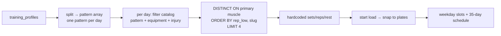
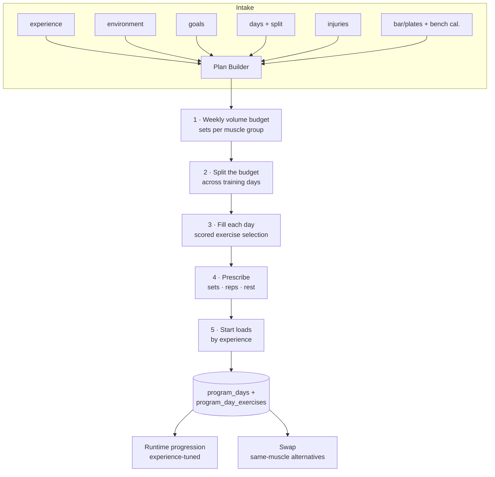
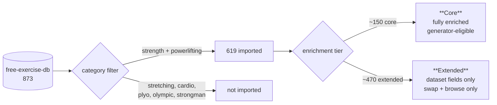
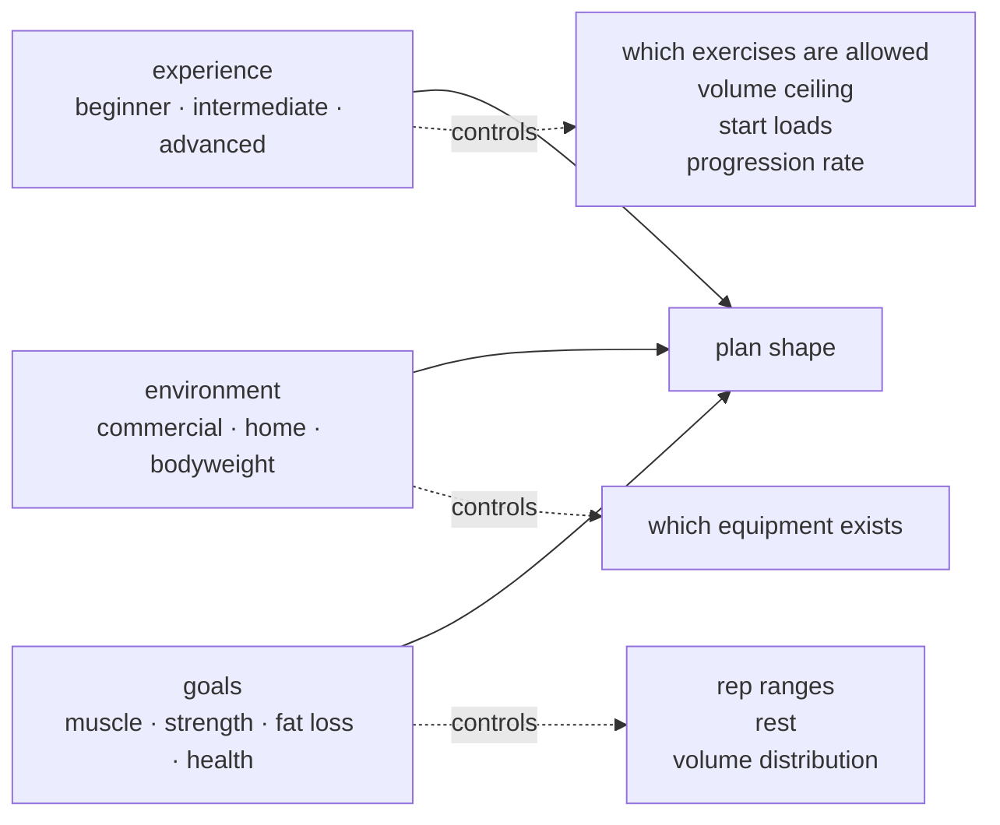
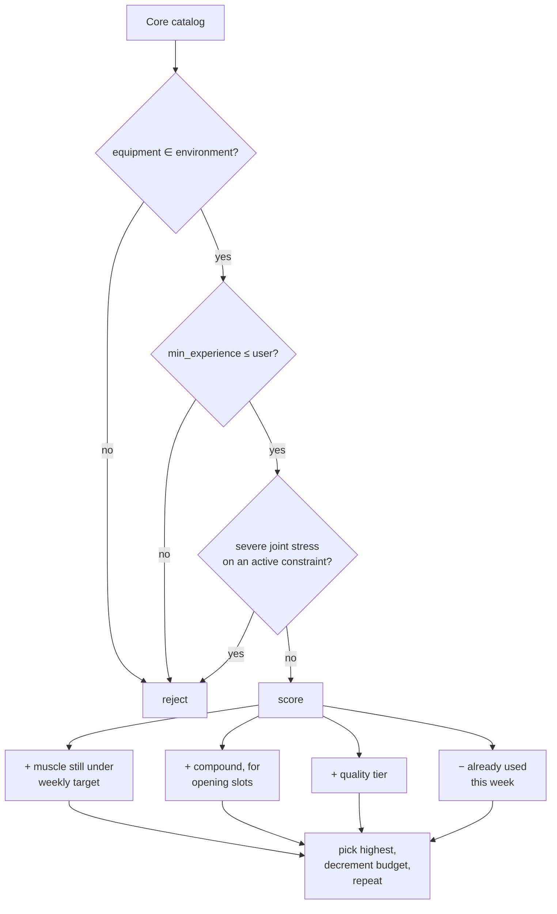

# Exercise Plan Builder — Design

**Date:** 2026-08-23 · **Status:** design, not yet approved · **Scope:** catalog, generation, progression, swap, onboarding intake

---

## 1. Where we are today

`bootstrap_user_program()` builds a plan in one pass:



It works for one split and quietly fails for the other two.

### Two live bugs

The split→pattern map (verified on the production function, not just the migration):

| Split | Needs | Generator emits | Result |
|---|---|---|---|
| `push_pull_legs` | push · pull · legs | `{push, pull, legs}` | ✅ correct |
| `upper_lower` | Upper = push+pull, Lower = legs | `{push, legs}` | ❌ **no back/pull work at all** |
| `full_body` | all muscles across 2 days | `{push, pull}` | ❌ **legs never appear** |

All 8 live programs are PPL, so nobody is broken *today*. But the split toggle shipped this week makes `full_body`/`upper_lower` one tap from Profile — this turns live on the next tap.

**These are symptoms, not the disease.** The generator assumes *one pattern per day* and *exactly 4 exercises*. That happens to be right for PPL because each pattern has exactly 4 primary muscles. An Upper day spans 8 muscles; a full-body day spans 12. Fixing the arrays alone can't fix that.

### Design gaps

1. **Goals are collected, stored, and ignored.** "Build muscle" and "Get stronger" generate identical plans.
2. **No weekly volume planning.** Progress judges you against a 10–20 sets/muscle/week band the generator never targets. Volume is an accident.
3. **Selection is alphabetical.** `ORDER BY default_rep_low, slug` is a compound-first *proxy*; no quality ranking, no antagonist balance, no cross-day variety.
4. **Fixed 4 exercises, fixed set counts**, regardless of day count, experience, or goal.
5. **Every user is treated as intermediate in a commercial gym** — see below.
6. **`load_type` filtered to 2 of 6 values**, so timed/assisted/weighted-bodyweight movements can never enter a plan.

---

## 2. What we already have and don't use

The schema anticipated most of this. It's wired to nothing.

| Field | Values | Asked in onboarding? | Used by generator? |
|---|---|---|---|
| `experience` | beginner · intermediate · advanced | ❌ never → **NULL** | ❌ |
| `environment` | commercial_gym · home_gym · bodyweight_only | ❌ never → **NULL** | ⚠️ read, but defaults to `commercial_gym` |
| `goals` | build_muscle, strength, lose_fat, general_health | ✅ **populated for every user** | ❌ |
| `mechanic` | — | — | ❌ column doesn't exist yet |

Two consequences worth stating plainly:

- **Every home-gym user currently gets commercial-gym machine picks**, because `environment` is NULL and the generator coalesces to `commercial_gym`.
- **The goals screen is not the problem.** It collects good data (`{build_muscle,strength}`, `{build_muscle,lose_fat}`…). Keep it — and start using it. Nothing gets removed from onboarding; two questions get *added*.

---

## 3. Target architecture

The core inversion: stop picking *exercises per pattern*, start allocating *sets per muscle per week*, then fill those sets with exercises.



Each stage is independently testable, which the current single-query design is not.

---

## 4. The catalog

### Source

[`yuhonas/free-exercise-db`](https://github.com/yuhonas/free-exercise-db) — **873 exercises, The Unlicense (public domain), 1.8k stars.** Verified structure and distributions:

| Field | Distinct values | Notes |
|---|---|---|
| `level` | beginner 523 · intermediate 293 · expert 57 | → maps to our `experience_level` |
| `mechanic` | compound 489 · isolation 297 · null 87 | **the compound-first signal we currently fake** |
| `force` | pull 371 · push 369 · static 104 | helps derive `pattern` |
| `equipment` | 13 values | barbell 170, dumbbell 123, body only 111, cable 81, machine 67… |
| `primaryMuscles` | 17 values | quadriceps 148, shoulders 127, abdominals 93… |
| `category` | 7 values | strength 581, powerlifting 38 → **619 usable**; drop stretching/cardio/plyo |
| `images` | 2 per exercise | usable for the guide screen |

### Two tiers — this is the key decision

Importing 873 rows does **not** mean the generator picks from 873. The dataset lacks the metadata our safety and volume logic depend on (joint stress, muscle contribution, start loads, rep ranges). Authoring that for 619 exercises is weeks of work; authoring it for the ~150 that matter is days.



- **Core (~150):** joint stress, muscle contribution, rep ranges, start loads, weight step, unilateral flag — all authored. Only these can be *auto-selected* into a plan.
- **Extended (~470):** imported as-is. Surfaced in swap and search, flagged "we know less about this one." A user can opt into them; the generator never picks them unprompted.

A boolean `is_core` on `exercises` gates this. It also gives us a growth path: promote Extended → Core over time without re-importing.

### Field mapping

| Dataset | Ours | Rule |
|---|---|---|
| `name` | `name`, `slug` | slugify; dedupe against existing 40 by slug + alias |
| `level` | `min_experience` *(new)* | expert → `advanced` |
| `mechanic` | `mechanic` *(new)* | null → infer from primary-muscle count |
| `force` + `primaryMuscles` | `pattern` | push/pull/legs/core decision table |
| `equipment` | `exercise_equipment` | 13 → our 9 slugs; `e-z curl bar`→barbell, `bands`→new, ball/foam/other→Extended only |
| `primaryMuscles` | `exercise_muscles(role=primary)` | 17 → our 18; see delt problem below |
| `secondaryMuscles` | `exercise_muscles(role=secondary)` | contribution 0.5 default, authored for Core |
| `instructions` | `description` | joined |
| `images` | `demo_path` | optional mirror to our bucket |

**The delt problem.** The dataset lumps 127 exercises as `shoulders`; we split Front/Side/Rear Delt — a split our volume logic depends on. Resolution: keyword rules on the name (`lateral raise`→side, `rear delt`/`reverse fly`→rear, `overhead press`/`front raise`→front), then **manual review of the shoulder subset inside Core only**. Extended shoulder entries keep a generic Shoulders mapping.

**Not in the dataset, must be authored for Core:** joint stress (our injury routing is meaningless without it), muscle contribution weights, `default_rep_low/high`, `default_start_kg`, `weight_step_kg`, `is_unilateral`.

---

## 5. The user model

Three axes, all already in the schema:



**Experience gates exercise difficulty.** A beginner never gets an `expert`-level lift auto-selected. Rule: `exercise.min_experience <= user.experience`. Advanced users still see beginner lifts (they're staples, not training wheels).

---

## 6. Generation algorithm

### Stage 1 — weekly volume budget

Hard sets per muscle group per week, by experience:

| Experience | Sets/muscle/week | Rationale |
|---|---|---|
| Beginner | 8–10 | Technique and recovery are the limiter, not volume |
| Intermediate | 12–16 | The productive middle |
| Advanced | 16–20 | Needs more stimulus to progress |

Goal modifies distribution, not the ceiling:

| Goal | Rep range | Rest | Volume note |
|---|---|---|---|
| `build_muscle` | 6–12 | 90–120s | Full budget |
| `strength` | 3–6 | 180s | −20% volume, compounds weighted heavily |
| `lose_fat` | 10–15 | 60–90s | Full budget (preserve mass), shorter rest |
| `general_health` | 8–15 | 90s | Low end of the budget |

Multiple goals: the **first-picked goal leads** (onboarding already captures order), others blend at half weight.

### Stage 2 — split the budget across days

Each split defines a **muscle set per day**, not a single pattern:

| Split | Day types | Muscles per day |
|---|---|---|
| `push_pull_legs` | Push · Pull · Legs | 4 · 4 · 4 |
| `upper_lower` | Upper · Lower | **8** · 4 (+core) |
| `full_body` | Full A · Full B | ~6 each, alternating emphasis |

Weekly budget ÷ days that train a muscle = sets per muscle per session. This is where the current design breaks and the new one doesn't: the day is defined by *muscles to cover*, and exercise count follows from that (capped 4–6 for session length) instead of being hardcoded.

### Stage 3 — scored selection



Hard filters stay hard (safety and availability are not negotiable). Everything else becomes a score, so selection degrades gracefully — a bodyweight-only user with a shoulder flag still gets a coherent plan instead of an empty day.

### Stage 4 — prescription

Sets, reps, and rest come from the goal table above; set count per exercise falls out of the per-session muscle budget. Compounds open the session, isolation closes it (now driven by `mechanic`, not a rep-range proxy).

### Stage 5 — starting loads

| Experience | Barbell | Other |
|---|---|---|
| Beginner | Empty bar | 0.4 × catalog default |
| Intermediate | Catalog default, or history | Catalog default |
| Advanced | History-driven; catalog default as floor | History-driven |

Bench calibration (already built) overrides for bench. All loads snap to loadable plates (already built).

---

## 7. Progression by experience

The runtime half — `train_screen()` already does double progression, but with one hardcoded rule for everyone. Parameterize it:

| Experience | Scheme | Increment | Stall handling |
|---|---|---|---|
| **Beginner** | Linear per session | +2.5kg upper · +5kg lower | Repeat the weight |
| **Intermediate** | Double progression (current) | +1 loadable step at top of range with RIR ≥ 1 | Hold, then Progress flags it |
| **Advanced** | Double progression, slower | +1 step, or rep-only if RIR 0 | **Deload 10% after 3 stalled sessions** |

Beginners adapt session-to-session and should be loaded that way; advanced lifters need the deload branch we don't have at all today.

---

## 8. Exercise swap

"Sure could swap the exercise if they want to do a different one for the same muscle."

- Entry point: tap an exercise in the Train tab plan list → **Swap**.
- Candidates: same primary muscle, passing the same hard filters (equipment, experience, injury). **Core ranked first, Extended below a divider** with a "less data" note.
- Persistence: writes an override on `program_day_exercises` — survives regeneration unless the split changes.
- Load carry-over: the new exercise starts from its own history if present, else its catalog default. Never inherits the replaced lift's weight.

---

## 9. Onboarding changes

Current steps: `goal · body · days · bar · map · review`.

- **Keep `goal`** — now actually drives rep ranges, rest, and volume.
- **Add `experience`** — "How long have you trained consistently?" → `<6 months` / `6 months–2 years` / `2+ years`. Editable later in Profile.
- **Add `environment`** — "Where do you train?" → commercial gym / home gym / bodyweight only. Fixes the silent commercial-gym default.

Two new taps, both single-select. Existing users default to `intermediate` + `commercial_gym` (today's implicit behavior) and get prompted once in Profile.

---

## 10. Data model changes

```sql
-- exercises
ALTER TABLE exercises
  ADD COLUMN min_experience experience_level DEFAULT 'beginner',
  ADD COLUMN mechanic       text,      -- compound | isolation
  ADD COLUMN force          text,      -- push | pull | static
  ADD COLUMN is_core        boolean NOT NULL DEFAULT false,
  ADD COLUMN source         text;      -- 'load' | 'free-exercise-db'

-- program_day_exercises
ALTER TABLE program_day_exercises
  ADD COLUMN swapped_from_exercise_id uuid REFERENCES exercises(id),
  ADD COLUMN is_user_choice boolean NOT NULL DEFAULT false;

-- new: volume targets, so tuning doesn't need a migration
CREATE TABLE volume_targets (
  experience experience_level NOT NULL,
  goal       goal_type        NOT NULL,
  sets_min   int NOT NULL,
  sets_max   int NOT NULL,
  rep_low    int NOT NULL,
  rep_high   int NOT NULL,
  rest_sec   int NOT NULL,
  PRIMARY KEY (experience, goal)
);
```

`pattern` stays `text` and becomes derived rather than authoritative — the muscle set is what the generator reasons about.

---

## 11. Rollout

| Phase | Ships | Risk |
|---|---|---|
| **0 — stop the bleeding** | Fix `upper_lower`/`full_body` mapping to multi-pattern muscle sets | Low; contained to one `case` + the selection query |
| **1 — intake** | Add experience + environment to onboarding, backfill existing users | Low |
| **2 — catalog** | Import 619, enrich ~150 Core, keep 40 existing as Core | Medium; enrichment is the real cost |
| **3 — generator** | Volume-driven generation, goal-aware prescription | High; regenerates everyone's plan |
| **4 — progression** | Experience-tuned progression + deload | Medium |
| **5 — swap** | Swap UI + override persistence | Low |

Phase 0 is worth doing immediately and independently — it's a live bug behind a one-tap control.

---

## 12. Open questions

1. **Regeneration on rollout.** Phase 3 changes every plan. Auto-regenerate, or prompt each user ("your plan can be rebuilt with what we now know")? Prompting is safer but leaves users on the old logic.
2. **Core set membership.** Who picks the ~150? I can propose a list from muscle × equipment coverage for review.
3. **Images.** Mirror the dataset's 1,700 images to our bucket, or hot-link GitHub? Mirroring costs storage; hot-linking risks the repo moving.
4. **`general_health` goal** currently has no distinct training meaning — is it a real goal or a "no strong preference" signal?
5. **Deload** doesn't exist anywhere in the app yet — Phase 4 introduces the concept to the user, which needs UI language.
